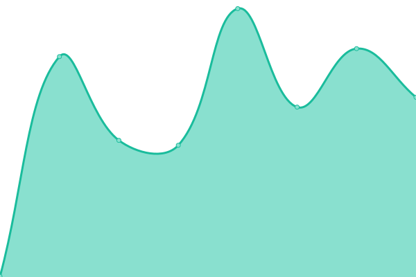
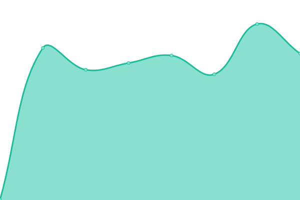
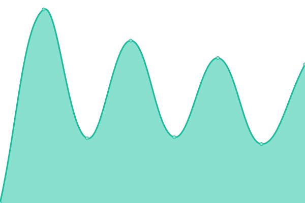

# [📈 Live Status](https://kmontag.github.io/upptime): <!--live status--> **🟩 All systems operational**

This repository contains the open-source uptime monitor and status page for [Kevin Montag](http://mont.ag), powered by [Upptime](https://github.com/upptime/upptime).

With [Upptime](https://upptime.js.org), you can get your own unlimited and free uptime monitor and status page, powered entirely by a GitHub repository. We use [Issues](https://github.com/kmontag/upptime/issues) as incident reports, [Actions](https://github.com/kmontag/upptime/actions) as uptime monitors, and [Pages](https://kmontag.github.io/upptime) for the status page.

<!--start: status pages-->
<!-- This summary is generated by Upptime (https://github.com/upptime/upptime) -->
<!-- Do not edit this manually, your changes will be overwritten -->
<!-- prettier-ignore -->
| URL | Status | History | Response Time | Uptime |
| --- | ------ | ------- | ------------- | ------ |
|  a🤖a | 🟩 Up | [a-a.yml](https://github.com/kmontag/upptime/commits/HEAD/history/a-a.yml) | 

 337ms
     
 | 

<a href="https://kmontag.github.io/upptime/history/a-a">100.00%</a>
    

|  b💻b | 🟩 Up | [b-b.yml](https://github.com/kmontag/upptime/commits/HEAD/history/b-b.yml) | 

 673ms
     
 | 

<a href="https://kmontag.github.io/upptime/history/b-b">100.00%</a>
    

|  c👩‍⚕️c | 🟩 Up | [c-c.yml](https://github.com/kmontag/upptime/commits/HEAD/history/c-c.yml) | 

 5160ms
     
 | 

<a href="https://kmontag.github.io/upptime/history/c-c">100.00%</a>
    

<!--end: status pages-->

[**Visit our status website →**](https://kmontag.github.io/upptime)

## 📄 License

- Powered by: [Upptime](https://github.com/upptime/upptime)
- Code: [MIT](./LICENSE) © [Anand Chowdhary](https://anandchowdhary.com), supported by [Pabio](https://pabio.com)
- Data in the `./history` directory: [Open Database License](https://opendatacommons.org/licenses/odbl/1-0/)
